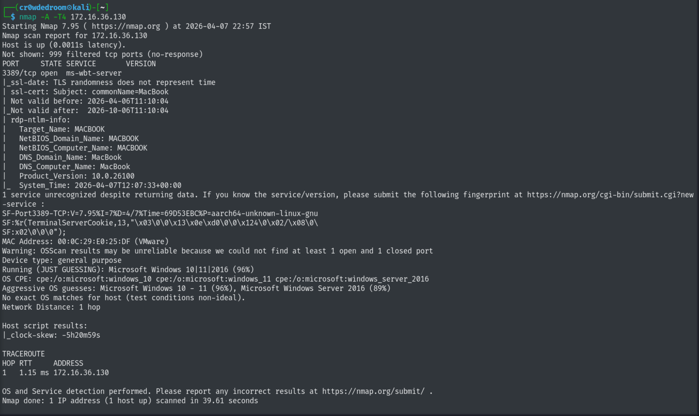
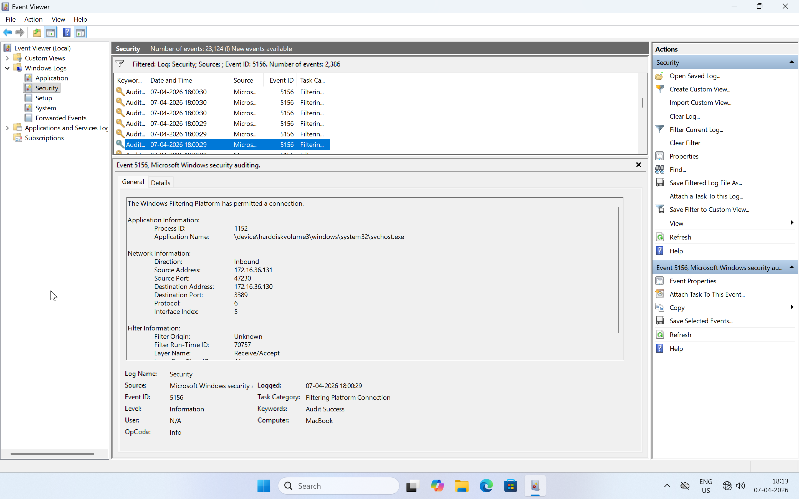
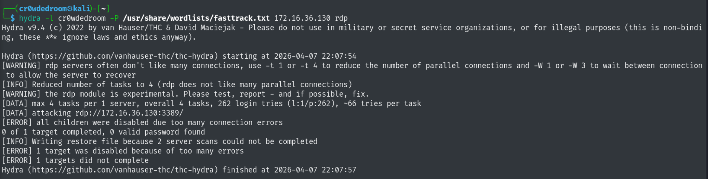
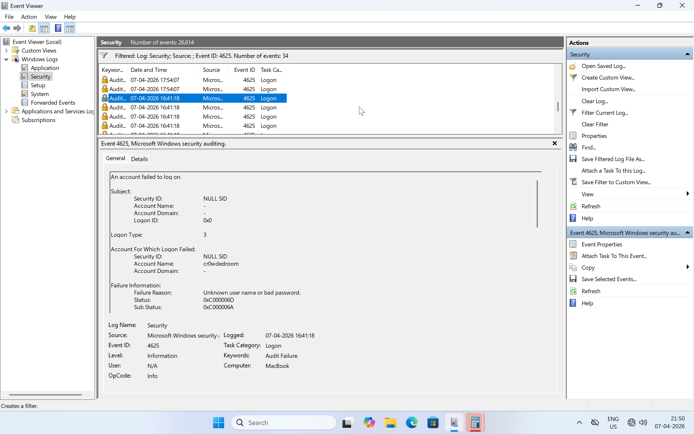
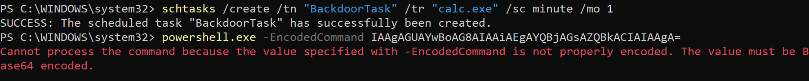
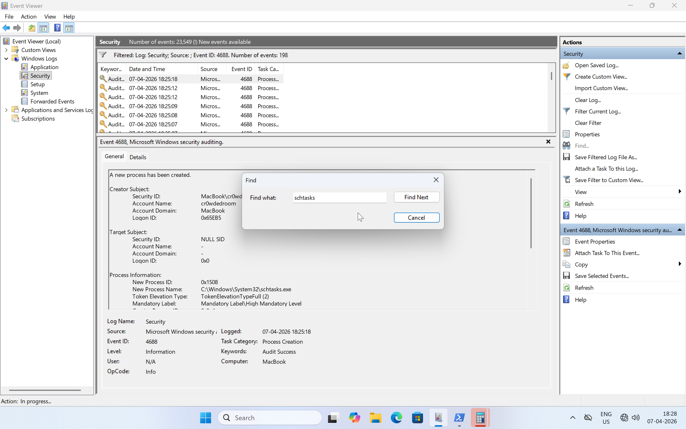
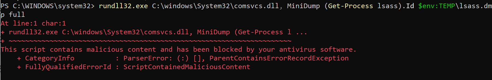
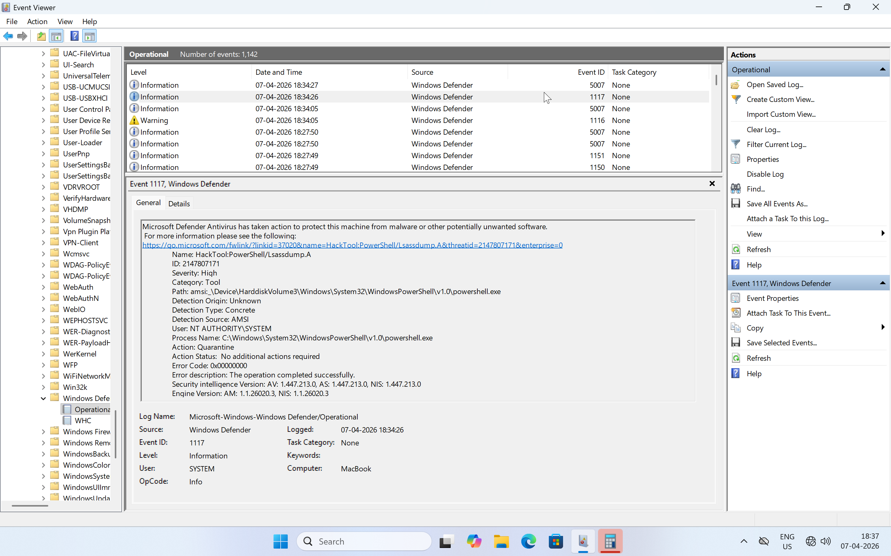
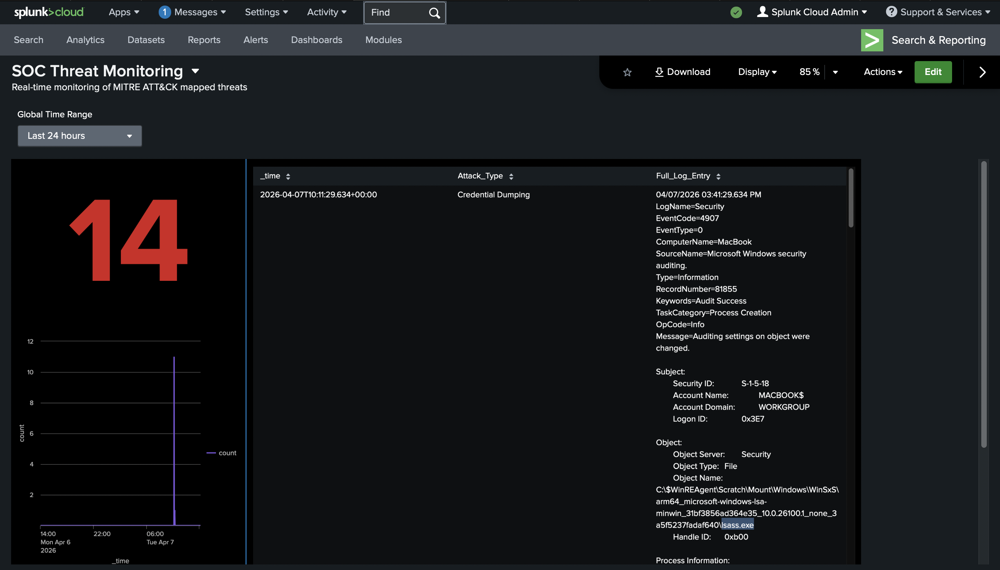

# SIEM-and-Threat-Detection-Lab

This lab demonstrates end-to-end proficiency in threat detection and SOC analyst workflows. The core objective was to build a functional SIEM-based detection environment and validate it against real attack simulations. This involved:  

1. Setting up a two-VM isolated network environment (Kali Linux and Windows 11 ARM) with Sysmon capturing deep host telemetry across all critical event categories.  
2. Configuring Splunk Cloud to ingest Windows log sources and deploying custom correlation rules mapped to the MITRE ATT&CK framework.  
3. Simulating targeted attack chains (e.g., Active Scanning, Brute Force, Credential Dumping, Persistence via Scheduled Tasks and PowerShell Execution) to generate real security alerts.  
4. Performing SOC triage by analyzing Splunk detections against raw Security Logs using Event Viewer, confirming True Positives and visualizing on Splunk Dashboard.

---
Phase 1: Environment Setup & Network Preparation  
---
Established a secure, isolated virtual network where the Kali Linux (Attacker) can interact with the Windows 11 (Victim/SIEM) host using static configurations to ensure reliable log indexing.  

**Step 1.1: VM IP Address Confirmation -**  
To ensure both Kali and Windows VM were on the same subnet, I switched the Network Adapter Settings to Host-Only. Then executed command `ifconfig` on Kali and `ipconfig` on Windows to confirm the same.  

**Step 1.2: Connectivity & ICMP Handshake -**  
By default, Windows 11 ARM blocks pings. So had to open a specific hole in firewall using command `New-NetFirewallRule -DisplayName "Allow ICMPv4-In" -Direction Inbound -Protocol ICMPv4 -IcmpType 8 -Action Allow` to allow Kali VM to see Windows VM, which was later verified by running `ping 172.16.36.130 -c 4`

**Step 1.3.1: Splunk Cloud SIEM Provisioning -**  
Signed up for Splunk Cloud Free Trial and got an assigned Splunk Cloud Admin account with credentials on email.  

  

**Step 1.3.2: Universal Forwarder for Windows -**  
Downloaded Universal Forwarder (UF) on Windows VM that speaks its language (ARM).  

  

**Step 1.3.3: Credentials for Cloud-Windows connection -**  
Downloaded Universal Forwarder Credentials so the Cloud knows to trust my Windows VM.  

  

**Step 1.3.4: Linking Windows to Splunk Cloud -**  
Opened Powershell as Administrator in Windows and ran command `cd C:\Program Files\SplunkUniversalForwarder\bin` to navigate to the Splunk bin folder, then ran `.\splunk install app C:\Users\YourName\Desktop\splunkclouduf.spl`  to install the cloud credentials and finally `.\splunk restart` to restart the forwarder.  

  

---
Phase 2: Data Ingestion & Endpoint Visibility  
---
Focused on the deployment of advanced endpoint telemetry by installing Sysmon on Windows VM and the configuration of the data ingestion pipeline to achieve deep visibility into system-level activity.  

**Step 2.1: Install Sysmon -**  
Sysmon (System Monitor) is a Microsoft tool that provides deep-level telemetry (Process Creation, File Creation time changes, Network Connection). I downloaded it from [Microsoft Sysinternals](https://learn.microsoft.com/en-us/sysinternals/downloads/sysmon).  

  

And then downloaded [SwiftOnSecurity's Config](https://github.com/SwiftOnSecurity/sysmon-config/blob/master/sysmonconfig-export.xml) as filter so I don't overwhelm my Windows VM.  

  

Expanded the downloaded Sysmon zip file in a new directory and ran `.\Sysmon64.exe -i ..\sysmonconfig-export.xml -accepteula` to configure Sysmon with the downloaded configuration file.  

**Step 2.2: Data Pipeline Configuration -**  
Now that Sysmon is recording data, I opened Notepad as Administrator and created `inputs.conf` file so that it can pick up the data from Splunk Universal Forwarder and send it to Splunk Cloud.  

  

After copying `inputs.conf` file to `C:\Program Files\SplunkUniversalForwarder\etc\system\local`. I restarted the Splunk Service.  

**Step 2.3: Visibility Verification -**  
Verified the visibility of logs by using filter `index="main" | stats count by sourcetype` in Search & Reporting of Splunk Cloud.  

  

---
Phase 3: Detection Engineering & Data Visualization  
---
Transformed raw telemetry from the Windows Endpoint into actionable security intelligence by creating specific Detection Logic (Alerts) and High-Level Visibility (Dashboard).  

**Step 3.1: Alert Logic Development -**  
Alert 1 - Active Scanning (Nmap Scan Detected) [T1595](https://attack.mitre.org/techniques/T1595/)  
Scenario - Adversaries may execute active reconnaissance scans to gather information that can be used during targeting.  
I saved the following SPL query to look for `EventCode=3` and filter by `src_ip` where `unique_ports > 30`.  

  

In the Edit Alert Window, I changed it to run on cron schedule with time range of 60 seconds and trigger alerts when number of results is greater than 0, whilst using `src_ip` to suppress results and giving the triggered alerts a severity of High. I did the same with the other results, only Brute Force one was given Critical severity as the account was compromised.

  
  

Alert 2 - Brute Force Detected [T1110](https://attack.mitre.org/techniques/T1110/)  
Scenario - Adversaries may use brute force techniques to gain access to accounts when passwords are unknown or when password hashes are obtained.  
I saved the following SPL query to look for `EventCode=4625` in Security Logs and filter by `TargetUserName` and `src_ip` where `count > 10`.  

  

Alert 3 - Persistence via Scheduled Tasks [T1053.005](https://attack.mitre.org/techniques/T1053/005/)  
Scenario - Adversaries may abuse the Windows Task Scheduler to perform task scheduling for initial or recurring execution of malicious code.  
I saved the following SPL query that looks for `EventCode=1` and `Image="*schtasks.exe"`.

  

Alert 4 - OS Credential Dumping: LSASS Memory Detected [T1003.001](https://attack.mitre.org/techniques/T1003/001/)  
Scenario - Adversaries may attempt to access credential material stored in the process memory of the Local Security Authority Subsystem Service (LSASS).  
I saved the following SPL query that looks for `EventCode=10` and `TargetImage="*lsass.exe"`.  

  

Alert 5 - Command and Scripting Interpreter: PowerShell Detected [T1059.001](https://attack.mitre.org/techniques/T1059/001/)  
Scenario - Adversaries may abuse PowerShell commands and scripts for execution.  
I saved the following SPL query that looks for `EventCode=1` and for images like `powershell.exe` and `pwsh.exe` and command line filters like `-encodedcommand`, `bypass` and `-w hidden`.  

  

Here is a list of all them alerts I created that will trigger on the dashboard's charts.  

  

**Step 3.2: Visualization Design and Dashboard Layout -**  
Created a dashboard with title `SOC Threat Monitoring` with Absolute (Full Layout Control).  

  

Selected Single Value chart from the chart drop-down menu.  

  

Custom SPL Query for this chart to show count of alerts with `EventCode=4625 OR EventCode=3`  

  

Made coloring changes so that it shows numbers in red if alerts are 1 or greater than 1, green if they are 0.  

  

2nd Chart showing a timechart of events with `EventCode=1 OR EventCode=3 OR EventCode=4625`  

  

Finally, 3rd one is a table to show `_time`, the `Attack_Type` that was performed along with `CommandLine`.  

  

Adjusted the charts and table to look like a proper dashboard for SOC Analyst to visualize.  

  

---
Phase 4: Attack Simulation  
---
.  

**Step 4.1: Adversary Simulation & Event Log Correlation -**  
Performed Nmap scan using command `nmap -A -T5 172.16.36.130` on Kali Linux and validated it by filtering for EventCode `5156` which shows `Source Address: 172.16.36.131` and `Destination Address: 172.16.36.130` in `Event Viewer > Windows Logs > Security`. 

    

  

.  

  

.  

  

.  

  

.  

  

.  

  

.  

  

**Step 4.2: SIEM Dashboard Visualization -**  
I had to make some changes so the final dashboard displays the `Full_Log_Entry` and the correct `Attack_Type`. It successfully correlates disparate log sources into a single pane of glass. By identifying high-criticality events such as Credential Dumping and Brute Force attempts in real-time, the SIEM provides the necessary telemetry for rapid incident response.  

